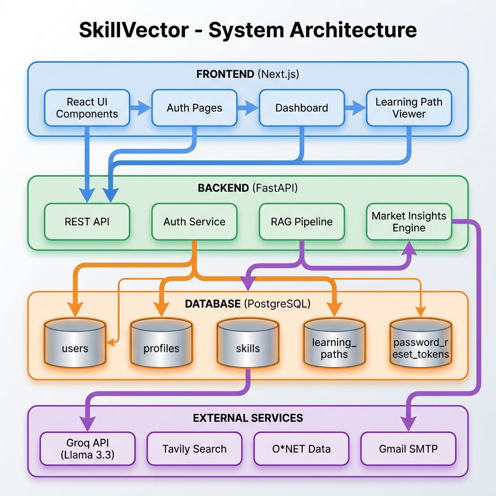
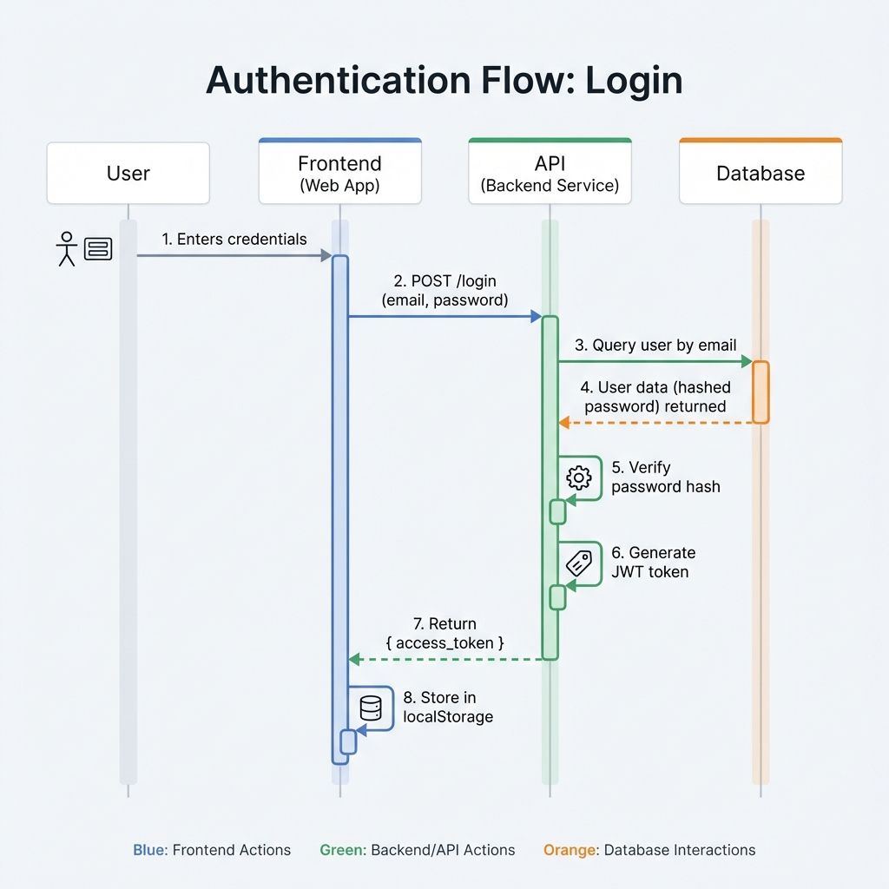
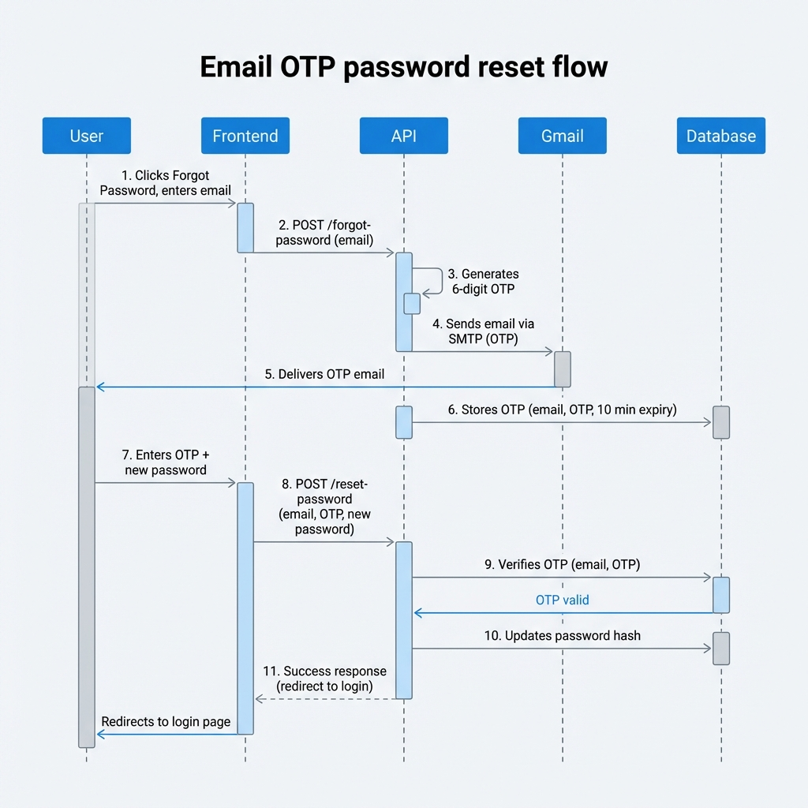
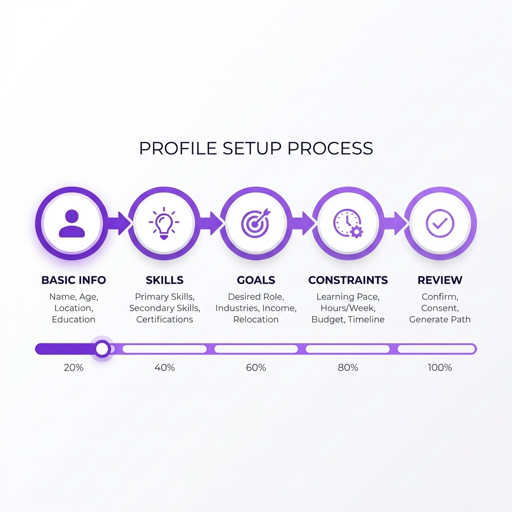
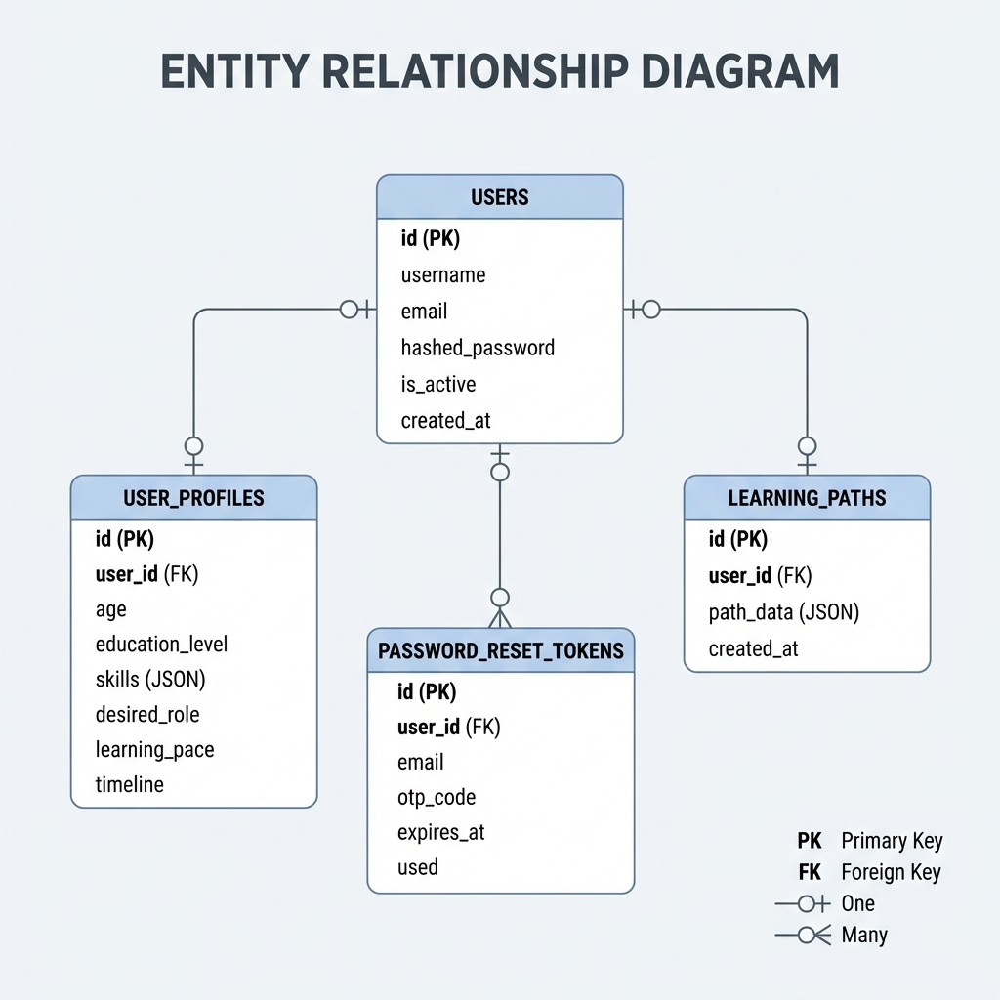
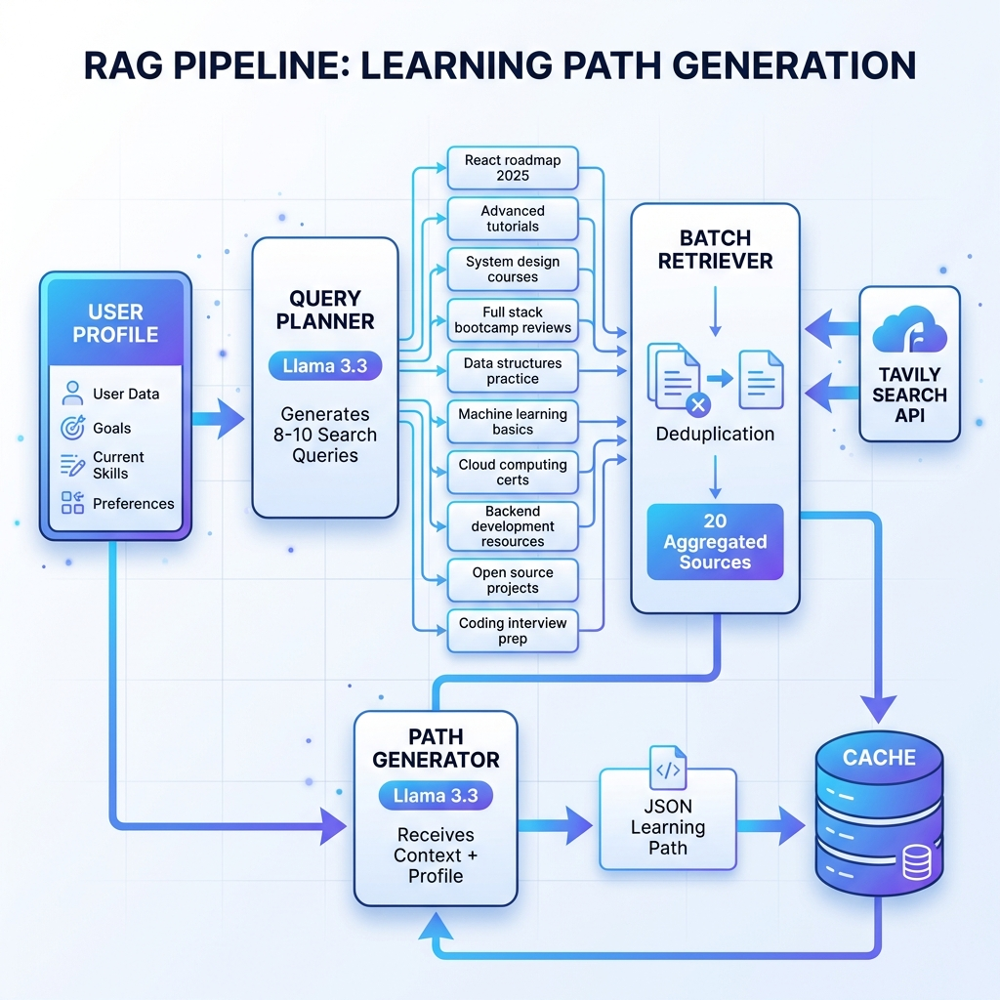
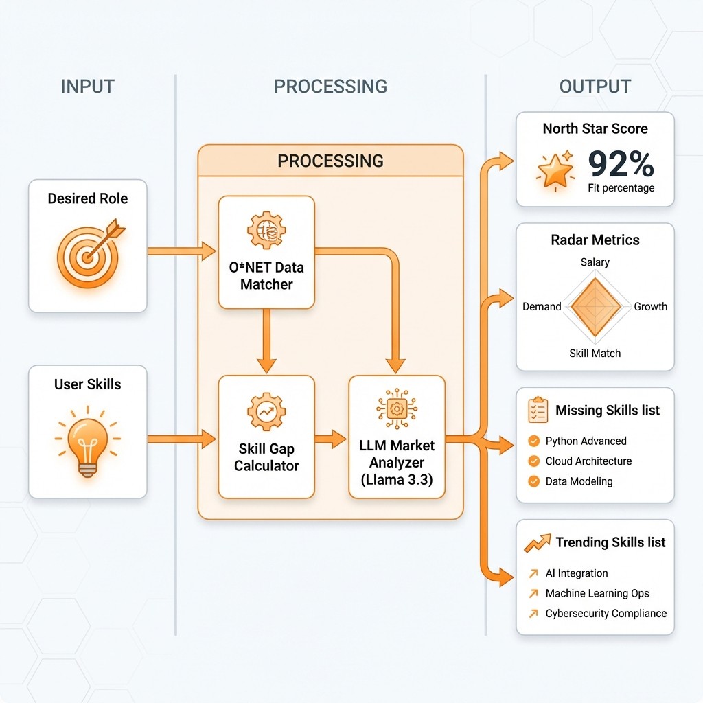

# SkillVector

> **AI-Powered Career Intelligence Platform** — Personalized learning paths powered by RAG, labor market analytics, and real-time skill gap analysis.

<p align="center">
  
  
  
  
  
</p>

---

## 🚀 What is SkillVector?

SkillVector is a full-stack AI system that bridges the gap between your current skills and your dream career. Unlike generic course recommenders, it:

- **Validates** career goals against real labor market data (O*NET)
- **Generates** personalized, week-by-week learning roadmaps
- **Grounds** all recommendations in verified web sources (zero hallucinations)
- **Analyzes** skill gaps with market-demand matching

---

## 📊 System Architecture



---

## 🔐 Authentication Flow



---

## 🔑 Forgot Password (Email OTP)



---

## 👤 Profile Building Wizard



---

## 🗄️ Database Schema



---

## 🧠 RAG Pipeline (Multi-Query Learning Path Generation)



---

## 📈 Market Insights Engine



---

## 🛠️ Tech Stack

| Layer | Technology |
|-------|------------|
| **Frontend** | Next.js 16, React, Tailwind CSS |
| **Backend** | FastAPI, Python 3.11 |
| **Database** | PostgreSQL 16 |
| **AI/ML** | Llama 3.3 70B (Groq) |
| **Search** | Tavily API |
| **Data** | O*NET 29.0 |

---

## 🚀 Quick Start

### Backend
```bash
cd server
pip install -r requirements.txt
uvicorn main:app --reload
```

### Frontend
```bash
cd frontend
npm install
npm run dev
```

---

## 📚 API Endpoints

| Endpoint | Method | Description |
|----------|--------|-------------|
| `/register` | POST | Create account |
| `/login` | POST | Authenticate (JWT) |
| `/forgot-password` | POST | Request OTP |
| `/reset-password` | POST | Reset with OTP |
| `/userdetails` | POST | Save profile |
| `/user-profile` | GET | Get profile |
| `/generate-path` | GET | Generate learning path |
| `/profile/analysis` | GET | Market insights |

---

<p align="center">Built with ❤️ for career transformation</p>
