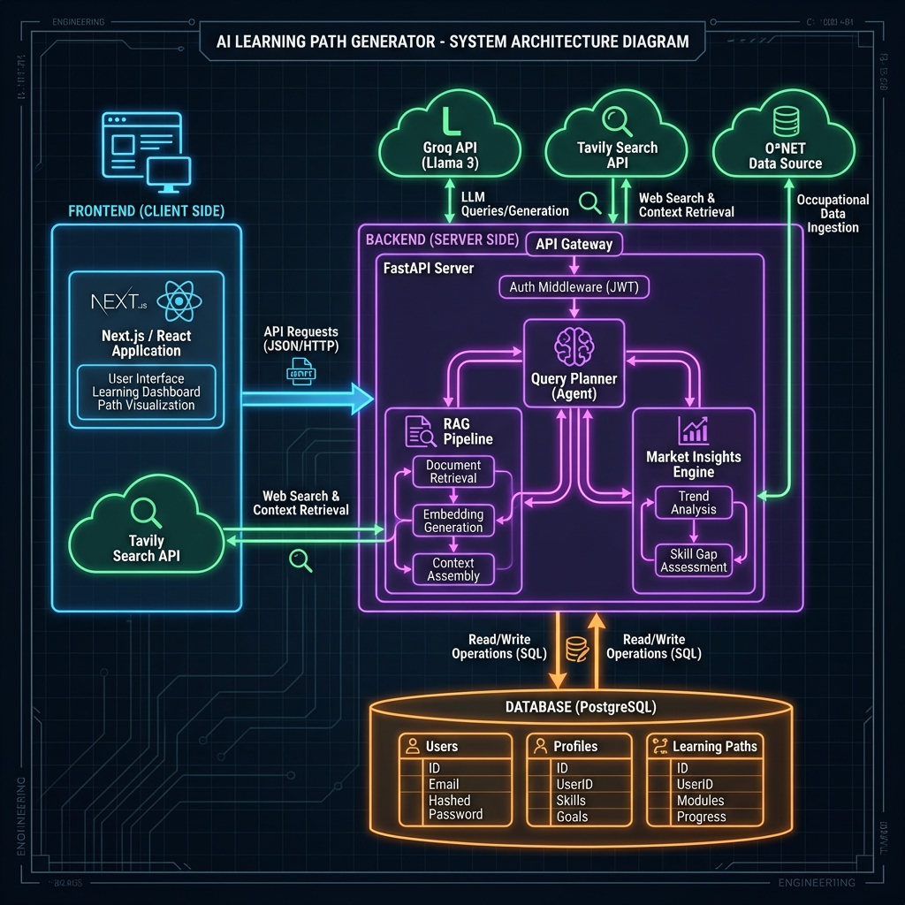
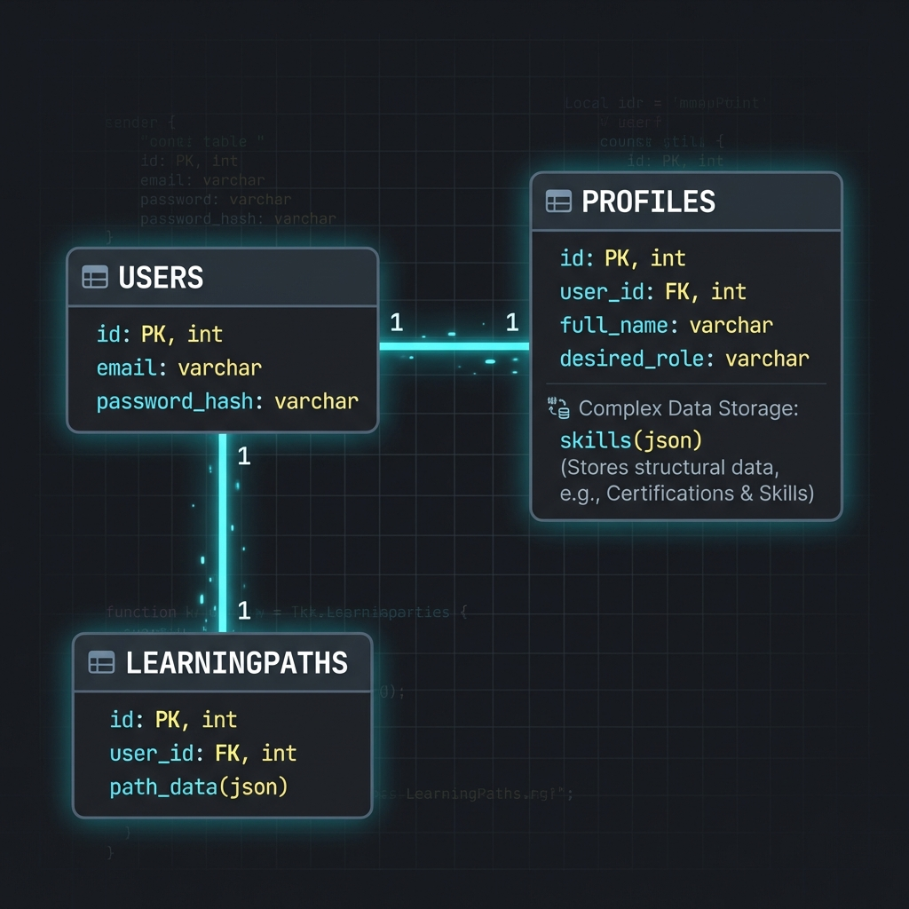

# AI Learning Path Generator with Labor Market Insights

## 🎯 Project Overview

**SkillVector - AI Learning Path Generator** is a full-stack AI system designed to bridge the gap between education and industry demands. It generates highly personalized, structured learning paths for users by leveraging **Retrieval-Augmented Generation (RAG)** and real-time **O*NET labor market data**.

Unlike standard course recommenders, this system:
- **Validates** user goals against actual labor market trends (salary, demand, growth).
- **Generates** multi-stage, week-by-week learning roadmaps grounded in high-quality web sources.
- **Identifies** skill gaps by comparing user profiles with standardized **SOC (Standard Occupational Classification)** codes.
- **Eliminates Hallucinations** by strictly grounding AI outputs in retrieved verified content.

This project is built for **college final-year submissions**, **client demos**, and **portfolio showcases**, demonstrating advanced AI integration in a production-ready architecture.

---

## 🧠 Core Features

### 1. User Authentication & Authorization
- **Secure Access:** Implements **JWT (JSON Web Token)** based authentication.
- **Password Security:** Uses `bcrypt` hashing via `passlib` to securely store credentials; passwords are never stored in plain text.
- **Protected Routes:** API endpoints are guarded by `OAuth2PasswordBearer`, ensuring only authenticated users can access profile and generation features.

### 2. User Profile Management
- **Detailed Profiling:** Captures comprehensive user data including education, current skills, desired role, location, learning pace (velocity), weekly hours, and budget sensitivity.
- **Persistent Storage:** Profiles are stored in a **PostgreSQL** database, linked securely to the user account.
- **Smart Invalidation:** Any update to critical profile fields (e.g., Target Role, Skills) automatically invalidates cached learning paths to ensure recommendations remain relevant.

### 3. AI Learning Path Generator
- **Structured Output:** Uses **Llama 3 (via Groq)** to generate JSON-structured roadmaps.
- **Custom Logic:**
  - **Goal-Oriented:** Align path duration with user's specific timeline.
  - **Granular Stages:** Breaks down learning into logical stages (e.g., "Foundations", "Advanced Concepts").
  - **Resource Curation:** Each module includes top-tier resources (Courses, Articles, Books) strictly verified against search results.

### 4. Multi-Query RAG Pipeline
- **Query Planner:** An LLM agent analyzes the user's profile to generate 8-10 diverse, high-value search queries (e.g., "Senior React Developer roadmap 2025", "Advanced System Design courses").
- **Batch Retrieval:** Uses **Tavily AI** to perform parallel web searches, retrieving high-quality, relevant content.
- **Context Aggregation:** deduplicates and aggregates search results into a clean context window for the generation model.

### 5. Source-Grounded Generation
- **Anti-Hallucination:** The LLM is strictly prompted to use *only* the provided search context for resource recommendations.
- **Validation:** Ensures that every course or article link suggested actually exists in the retrieved context.

### 6. Learning Path Caching System
- **Efficiency:** Generated paths are JSON-serialized and stored in the `learning_paths` table.
- **Performance:** Subsequent requests for the same profile load instantly from the database, saving API costs and reducing latency.
- **Auto-Expiry:** Caches are cleared automatically when user requirements change.

### 7. O*NET Labor Market Data Integration
- **Standardized Data:** Loads **O*NET 29.0** occupation and skill datasets into memory at startup for high-performance lookups.
- **Role Matching:** Uses fuzzy matching algorithms (TF-IDF/Cosine Similarity logic) to map free-text user roles (e.g., "React Dev") to standardized O*NET SOC codes (e.g., "15-1252.00 - Software Developers").

### 8. Labor Market Insights Engine
- **Gap Analysis:** Mathematically compares user's current skills against O*NET's "Hot Technologies" and top-demanded skills for the matched role.
- **Metric Generation:** Calculates a **"North Star Score"** (overall fit) and specific matches for **Salary**, **Demand**, and **Growth**.

### 9. AI Market Insights Layer
- **Real-Time Analysis:** An additional LLM layer analyzes current market trends (2025/2026 outlook) to supplement O*NET data.
- **Human-Readable Summaries:** Translates complex data into actionable insights (e.g., "Trending Skills: AI Agents, Rust", "Hot Sectors: Fintech").

---

## 🏗️ System Architecture

The system follows a modern **Monorepo-style** full-stack architecture.

### 🖥️ System Architecture Diagram



**Step-by-Step Data Flow:**

1.  **🚀 User Login**: Frontend sends credentials → API verifies & issues **JWT**.
2.  **📝 Profile Setup**: User hits `/profile` → Data saved to **Postgres** (Skills, Education, etc.).
3.  **⚡ Path Generation Request**: User clicks "Generate" → API triggers **Query Planner**.
4.  **🔍 Smart Retrieval**:
    *   **Planner** generates 8-10 targeted search queries.
    *   **Tavily** executes searches in parallel.
    *   **RAG** aggregates & cleans results.
5.  **🤖 AI Construction**:
    *   **Llama 3** receives User Profile + Verified Search Results.
    *   Constructs a valid JSON learning path.
6.  **💾 Caching**: Valid JSON path is saved to `learning_paths` table for instant future access.
7.  **📉 Market Analysis**: System loads O*NET data → Matches User Role → Calculates Demand/Salary scores.

---

## 🗄️ Database Design

The database is normalized to ensure data integrity and efficient querying.

### 📊 Database ER Diagram



**Key Relationships:**
- **One-to-One:** Users have exactly one Profile.
- **One-to-One:** Users have exactly one Active Learning Path (logically enforced).
- **JSON Fields:** `skills` and `path_data` are stored as JSONB for flexibility, allowing list structures without creating dozens of mapping tables.

---

## 🧪 API Documentation

### Base URL: `http://localhost:8000`

### 1. Authentication

**POST** `/register`
- **Body:**
```json
{
  "username": "johndoe",
  "email": "john@example.com",
  "password": "securepassword123"
}
```

**POST** `/login`
- **Body:**
```json
{
  "email": "john@example.com",
  "password": "securepassword123"
}
```
- **Response:**
```json
{
  "access_token": "eyJhbGciOiJI...",
  "token_type": "bearer",
  "user_id": 1
}
```

### 2. Profile

**POST** `/userdetails` (Save/Update Profile)
- **Body:** `{ ...full profile object... }`

**GET** `/user-profile`
- Retrieves the logged-in user's profile details.

### 3. Generation

**GET** `/generate-path`
- **Headers:** `Authorization: Bearer <token>`
- **Response:** Returns the complex JSON object containing the full learning path structure.

### 4. Market Insights

**GET** `/profile/analysis`
- **Response:**
```json
{
  "north_star": { "score": 85, "velocity": "Fast" },
  "radar": { "salary": 80, "demand": 90, "growth": 85, "skill": 70 },
  "gap_analysis": {
    "missing_skills": ["Docker", "Kubernetes"],
    "market_skills": ["React", "Node.js", "Docker", "AWS"]
  }
}
```

---

## 🚀 Deployment

### Local Deployment

1.  **Clone the Repository**
2.  **Backend Setup:**
    ```bash
    cd server
    python -m venv venv
    source venv/bin/activate  # or venv\Scripts\activate on Windows
    pip install -r requirements.txt
    
    # Set up .env
    # GROQ_API_KEY=...
    # TAVILY_API_KEY=...
    # DATABASE_URL=...
    
    uvicorn main:app --reload
    ```
3.  **Frontend Setup:**
    ```bash
    cd frontend
    npm install
    npm run dev
    ```

### Production Readiness (AWS/Docker)

- **Dockerization:** Both Frontend and Backend can be containerized.
    - `Dockerfile.backend`: `FROM python:3.9` -> `pip install` -> `CMD uvicorn`
    - `Dockerfile.frontend`: `FROM node:18` -> `npm build` -> `CMD npm start`
- **Cloud Architecture:**
    - **EC2:** Host Docker containers via Docker Compose.
    - **RDS (PostgreSQL):** Managed database service for reliability.
    - **Nginx:** Reverse proxy to route traffic (`/api` -> Backend, `/` -> Frontend).

**Why Production Ready?**
- Uses **Environment Variables** for secrets.
- **Stateless API** design (REST).
- **Database Persistence** (not in-memory).
- **Clean Separation** of concerns (Frontend/Backend).

---

## 🎓 Academic Value

1.  **Beyond CRUD:** This is not just a "Student Management System". It uses **Generative AI** and **RAG**, which are cutting-edge industry standards.
2.  **Real-World Data:** Integration with **O*NET** shows an understanding of data engineering and real-world datasets, not just dummy data.
3.  **Complex Architecture:** Demonstrates ability to connect LLMs, External APIs (Tavily), Databases, and Modern Frontends.

---

## 📈 Future Enhancements

1.  **Resume Parsing:** Upload a PDF resume to auto-fill the "Skills" and "Experience" profile sections using OCR/LLM.
2.  **Job Posting Ingestion:** Scrape LinkedIn/Indeed to get real-time job descriptions instead of just O*NET data.
3.  **Skill Scoring Models:** Create a quiz module to *verify* user skills rather than trusting self-reported data.
4.  **Feedback Loop:** Allow users to rate generated paths, finetuning the prompt using Reinforcement Learning from Human Feedback (RLHF) concepts.
